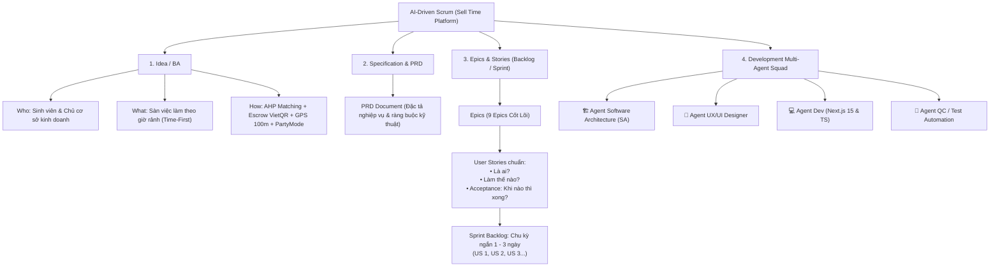

# QUY TRÌNH VẬN HÀNH AI-DRIVEN SCRUM (BMAD METHOD) - SELL TIME PLATFORM

Tài liệu này chuẩn hóa và ánh xạ toàn bộ quy trình phát triển dự án **Sell Time** theo đúng mô hình kiến trúc **AI-Driven Scrum** được minh họa trong sơ đồ của bạn.

---

## 🗺️ SƠ ĐỒ TỔNG THỂ AI-DRIVEN SCRUM CỦA DỰ ÁN



---

## I. NHÁNH 1: IDEA / BA (ĐỊNH HÌNH Ý TƯỞNG & PHÂN TÍCH NGHIỆP VỤ)

| Câu Hỏi Trọng Tâm | Định Nghĩa Cho Nền Tảng Sell Time |
| :--- | :--- |
| **WHO? (Là ai?)** | 1. **Sinh viên đại học (Huy TNUT)**: Có các block giờ rảnh lẻ giữa các tiết học, muốn kiếm thêm thu nhập tức thì.<br/>2. **Chủ cơ sở F&B/Bán lẻ (Lan The Cuppa)**: Thiếu nhân lực đột xuất trong 1–3 giờ hoặc cần người làm theo ca linh hoạt. |
| **WHAT? (Làm cái gì?)** | Sàn giao dịch việc làm thời gian thực theo triết lý **Time-First**: Khám phá công việc bằng thanh kéo giờ rảnh thay vì đọc mô tả việc làm dài dòng. |
| **HOW? (Làm bằng cách nào?)** | 1. **Matching Engine AHP 4 biến**: Thời gian (35%), Vị trí (25%), Kỹ năng (25%), Lương (15%).<br/>2. **Ký quỹ Escrow tức thì**: VietQR NAPAS 24/7 PayOS thanh toán ngay khi xong ca.<br/>3. **Chống gian lận 2 lớp**: Haversine GPS 100m kết hợp QR/PIN quầy `8866`.<br/>4. **Quản trị rủi ro bùng ca**: Pin Uy Tín (PartyMode Trust Battery 0–100%). |

---

## II. NHÁNH 2: SPECIFICATION & PRD (ĐẶC TẢ SẢN PHẨM)

- **File lưu trữ trong dự án**: [`_bmad-output/planning-artifacts/prd.md`](file:///C:/Users/admin/OneDrive/Desktop/selltime_project/_bmad-output/planning-artifacts/prd.md)
- **Nội dung đặc tả**:
  - Toàn bộ luồng người dùng (User Flows) của Ứng viên và Nhà tuyển dụng.
  - Các quy tắc kinh doanh (Business Rules): Công thức phạt/thưởng Pin Uy Tín, định mức ngân sách ký quỹ ca SOS.
  - Ràng buộc an ninh dữ liệu: Không lưu khóa API trên client, bảo đảm quỹ Escrow chống Double Spending.

---

## III. NHÁNH 3: EPICS $\rightarrow$ USER STORIES $\rightarrow$ SPRINT BACKLOG (1–3 NGÀY)

Theo đúng mô hình của bạn, mỗi User Story trong Sell Time bắt buộc phải có đủ 3 yếu tố:
1. **Là ai?** (Persona)
2. **Làm thế nào?** (How / Actions)
3. **Acceptance: Khi nào thì xong?** (Definition of Done)

### Cấu Trúc Mẫu 1 User Story Chuẩn:
```markdown
### US-1.1: Thanh Trượt Giờ Rảnh (Time Slider)
- Là ai: Sinh viên tìm việc theo giờ rảnh.
- Làm thế nào: Kéo thanh trượt từ 1h - 10h và bấm chọn 4 khung giờ (Sáng/Chiều/Tối/Đêm) trên đầu màn hình Khám phá.
- Acceptance (Khi nào thì xong):
  [x] Kéo thanh trượt cập nhật danh sách ca làm việc tức thì dưới 50ms.
  [x] Chọn buổi tính toán lại điểm lệch thời gian Delta-t.
  [x] Thẻ ca làm lệch hoàn toàn khung giờ bị tính điểm Time = 0.
```

### Chu Kỳ Sprint 1–3 Ngày (Fast Iteration Loop):
- **Sprint 1 (1–3 ngày)**: Hoàn thiện Lõi Time-First & So khớp AHP (US-1.1, US-1.2, US-1.3).
- **Sprint 2 (1–3 ngày)**: Hoàn thiện Điểm danh GPS Geofencing 100m & PIN quầy `8866` (US-5.1, US-5.2, US-5.3).
- **Sprint 3 (1–3 ngày)**: Hoàn thiện Ký quỹ VietQR Napas 24/7 & Rút tiền tức thì (US-4.1, US-4.2, US-4.3).
- **Sprint 4 (1–3 ngày)**: Hoàn thiện Trợ lý AI Coach STAR & Bóc tách CV (US-7.1, US-7.2, US-7.3).

---

## IV. NHÁNH 4: ĐỘI NGŨ 4 AI AGENTS CHUYÊN TRÁCH (DEVELOPMENT SQUAD)

Mỗi Agent đảm nhận một vai trò độc lập, phối hợp nhịp nhàng trong từng Sprint:

```
+-----------------------------------------------------------------------------------+
|                        BỘ TỨ AI AGENT TRONG SPRINT (1-3 NGÀY)                     |
+-----------------------------------------+-----------------------------------------+
| 🏗️ AGENT SOFTWARE ARCHITECTURE (SA)     | 🎨 AGENT UX/UI DESIGNER                 |
| - Thiết kế kiến trúc Clean Monolith     | - Chuẩn hóa Modern Dark Marketplace     |
| - Phân vùng Domain / Application / Infra| - Quy chuẩn bo góc 6px - 12px           |
| - Quản lý API routes, SSE chat, SQL DB  | - Bố cục Desktop 3 cột & Mobile Frame   |
| - Xác thực sơ đồ tương tác Archify      | - Thiết kế công thái học Touch Target   |
+-----------------------------------------+-----------------------------------------+
| 💻 AGENT DEV (FULLSTACK DEVELOPER)      | 🧪 AGENT QC / TEST AUTOMATION           |
| - Lập trình Next.js 15, React 19, TS    | - Viết bộ Regression Suite (Haversine,  |
| - Cài đặt thuật toán AHP & Haversine    |   AHP 4 biến, Pin PartyMode, Escrow)    |
| - Kết nối state management, Web Speech  | - Chạy kiểm thử tự động 12/12 PASS      |
| - Xử lý fallback serverless Vercel      | - Giám sát `npm run build` mã thoát 0   |
+-----------------------------------------+-----------------------------------------+
```

---

## V. CÁCH THỨC LẶP LẠI (ITERATIVE SPRINT CYCLE) BẰNG BMAD METHOD

Mỗi vòng lặp Sprint (1–3 ngày) diễn ra tuần hoàn tự động qua 5 bước:

1. **Sprint Planning**: Agent SA & PM mở [`sprint-status.yaml`](file:///C:/Users/admin/OneDrive/Desktop/selltime_project/_bmad-output/implementation-artifacts/sprint-status.yaml), kiểm tra Readiness Gate và chọn 2–3 User Stories cho Sprint mới (`ready-for-dev`).
2. **Design & UX Check**: Agent UX/UI rà soát component giao diện, màu sắc, bo góc và độ tương phản WCAG 2.1.
3. **Implementation**: Agent Dev nhận Story, lập kế hoạch chi tiết (`implementation_plan.md`) và lập trình tính năng.
4. **Verification**: Agent QC chạy `selltime-core.test.mjs` và kiểm tra biên dịch `npm run build`.
5. **Retrospective**: Cả 4 Agents tổng kết bài học, chuyển trạng thái Story sang `done` trong file `sprint-status.yaml` và chuyển tiếp sang Sprint tiếp theo!
