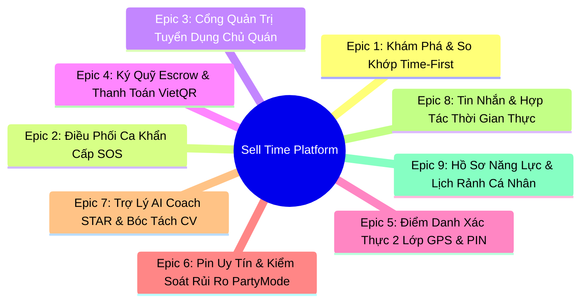

# BỘ ĐẶC TẢ EPIC & USER STORIES - DỰ ÁN SELL TIME PLATFORM

> **Dự án:** Sell Time - Nền tảng Sàn giao dịch việc làm theo giờ rảnh kết nối sinh viên & nhà tuyển dụng (Time-First Job Marketplace)  
> **Phương pháp quản trị:** Agile / Scrum  
> **Đối tượng người dùng (Personas):**
> 1. **Sinh viên tìm việc (Candidate / Student)**: Đại diện là *Nguyễn Đức Huy (TNUT)* - cần tìm việc bán thời gian theo các khung giờ trống giữa các tiết học để kiếm thêm thu nhập tức thì.
> 2. **Chủ cơ sở kinh doanh (Employer / Merchant)**: Đại diện là *Lan (Quán Cafe The Cuppa)* - cần tuyển nhân viên theo ca linh hoạt hoặc lấp ca khẩn cấp trong 1-2 giờ.
> 3. **Hệ thống Nền tảng (Platform / Admin / Escrow Engine)**: Tự động hóa điều phối, giữ tiền ký quỹ và tính toán điểm uy tín.

---

## TỔNG QUAN 9 EPICS CỐT LÕI

---

## EPIC 1: KHÁM PHÁ & SO KHỚP CA LÀM THEO GIỜ RẢNH (TIME-FIRST DISCOVERY & SMART MATCHING)

**Mô tả:** Đảo ngược mô hình tuyển dụng truyền thống. Thay vì đọc hàng chục mô tả công việc dài dòng, sinh viên chỉ cần chọn số giờ rảnh và khung giờ, hệ thống lập tức đề xuất các ca làm việc phù hợp nhất.

### User Stories Chi Tiết:

#### US-1.1: Thanh trượt tìm việc theo giờ rảnh (Time Slider)
- **User Story:** Là một *Sinh viên*, tôi muốn *kéo thanh trượt thời gian (1h - 10h) và chọn các buổi rảnh (Sáng/Chiều/Tối/Đêm)*, để *hệ thống lọc tức thì các ca làm việc khớp với khoảng thời gian trống của tôi*.
- **Độ ưu tiên:** P0 (Must have) | **Story Points:** 5
- **Tiêu chí chấp nhận (Acceptance Criteria):**
  - [x] Khi kéo thanh trượt từ 1h đến 10h, danh sách ca làm việc tự động cập nhật độ lệch thời gian $\Delta t$.
  - [x] Có thể chọn/bỏ chọn độc lập 4 chip buổi: Sáng (06:00-12:00), Chiều (12:00-18:00), Tối (18:00-22:00), Đêm (22:00-06:00).
  - [x] Nếu ca làm lệch hoàn toàn khung giờ, điểm thời gian $S_{Time} = 0$.

#### US-1.2: Tìm kiếm ngữ nghĩa thông minh bằng AI/NLP
- **User Story:** Là một *Sinh viên*, tôi muốn *gõ câu tìm kiếm tự nhiên (ví dụ: "Tối nay rảnh 4 tiếng gần trường TNUT")*, để *hệ thống tự động phân tích và áp dụng các bộ lọc mà tôi không cần bấm chọn thủ công*.
- **Độ ưu tiên:** P1 (Should have) | **Story Points:** 5
- **Tiêu chí chấp nhận:**
  - [x] Phân tích được các cụm từ chỉ thời gian ("tối nay", "sáng mai", "3 tiếng").
  - [x] Trích xuất từ khóa vị trí và kỹ năng ("pha chế", "phục vụ", "gần trường").
  - [x] Cung cấp 3 gợi ý mẫu (Prompt chips) để bấm tìm kiếm 1-chạm.

#### US-1.3: Thuật toán so khớp đa biến AHP 4 yếu tố (PRD FR-6)
- **User Story:** Là một *Sinh viên*, tôi muốn *thấy tỷ lệ % phù hợp và bảng giải trình chi tiết từng yếu tố của ca làm việc*, để *tôi biết lý do vì sao công việc này được đề xuất cho mình*.
- **Độ ưu tiên:** P0 (Must have) | **Story Points:** 8
- **Tiêu chí chấp nhận:**
  - [x] Điểm khớp $S$ được tính toán theo công thức chuẩn:
    $$S = 0.35 \times S_{Time} + 0.25 \times S_{Location} + 0.25 \times S_{Skill} + 0.15 \times S_{Salary}$$
  - [x] Hiển thị nhãn Badge phân cấp: Xanh ngọc ($\ge 85\%$), Xanh dương ($\ge 70\%$), Vàng ($\ge 50\%$), Xám ($< 50\%$).
  - [x] Có nút bấm mở rộng để xem chi tiết điểm số từng thành phần minh bạch.

#### US-1.4: Ứng tuyển ca làm việc 1-chạm
- **User Story:** Là một *Sinh viên*, tôi muốn *bấm nút "Ứng tuyển ngay" trên thẻ ca làm việc*, để *gửi ngay hồ sơ của tôi đến chủ quán mà không cần điền lại form phức tạp*.
- **Độ ưu tiên:** P0 (Must have) | **Story Points:** 3
- **Tiêu chí chấp nhận:**
  - [x] Nếu chưa đăng nhập, tự động kích hoạt AuthModal.
  - [x] Sau khi bấm, trạng thái thẻ ca chuyển thành "Đã ứng tuyển", lưu vào danh mục *Ca Của Tôi*.
  - [x] Bắn thông báo thời gian thực sang Dashboard của chủ quán.

---

## EPIC 2: ĐIỀU PHỐI CA LÀM KHẨN CẤP (SOS SHIFTS & INSTANT DISPATCH)

**Mô tả:** Cơ chế giải cứu đột xuất cho các cơ sở kinh doanh khi nhân viên nghỉ ốm hoặc thiếu người đột ngột trước giờ mở cửa 1-3 tiếng.

### User Stories Chi Tiết:

#### US-2.1: Đăng ca khẩn cấp SOS kèm thưởng nóng
- **User Story:** Là một *Chủ cơ sở kinh doanh*, tôi muốn *gắn cờ ca SOS và thiết lập khoản tiền thưởng nóng (ví dụ: +25.000đ/ca)*, để *thu hút ứng viên đến làm việc ngay lập tức*.
- **Độ ưu tiên:** P0 (Must have) | **Story Points:** 5
- **Tiêu chí chấp nhận:**
  - [x] Thẻ ca hiển thị viền đỏ cảnh báo nổi bật kèm nhãn `SOS Khẩn cấp`.
  - [x] Hiển thị rõ ràng mức thưởng nóng bổ sung cộng trực tiếp vào thù lao cơ bản.
  - [x] Số tiền ký quỹ Escrow tự động tính gộp cả lương cơ bản và thưởng SOS:
    $$\text{Tổng ngân sách} = (\text{Lương/giờ} \times \text{Số giờ}) + \text{Thưởng SOS}$$

#### US-2.2: Ưu tiên phân phối ca SOS cho ứng viên gần nhất
- **User Story:** Là một *Sinh viên ở gần quán (< 2km)*, tôi muốn *nhận được ưu tiên nhìn thấy các ca SOS đang cần người gấp*, để *tôi có thể nhận ca và có mặt trong vòng 30 phút*.
- **Độ ưu tiên:** P1 (Should have) | **Story Points:** 5
- **Tiêu chí chấp nhận:**
  - [x] Thẻ SOS được ghim lên đầu danh sách tìm kiếm khi sinh viên ở trong phạm vi khả dụng.
  - [x] Điểm cộng đặc biệt: Hoàn thành ca SOS 5 sao được thưởng tới **+5% Pin Uy Tín** (thay vì +3% ca thường).

---

## EPIC 3: CỔNG QUẢN TRỊ TUYỂN DỤNG DÀNH CHO CHỦ QUÁN (EMPLOYER PORTAL)

**Mô tả:** Bộ công cụ quản lý toàn diện giúp người sử dụng lao động đăng ca lặp lại nhanh chóng, duyệt ứng viên và kiểm soát ca làm việc hàng ngày.

### User Stories Chi Tiết:

#### US-3.1: Đăng ca nhanh bằng Template mẫu
- **User Story:** Là một *Chủ cơ sở*, tôi muốn *chọn nhanh các mẫu ca quen thuộc (Phục vụ tối, Pha chế SOS, Thu ngân cuối tuần)*, để *đăng ca tuyển dụng chỉ trong 30 giây*.
- **Độ ưu tiên:** P0 (Must have) | **Story Points:** 5
- **Tiêu chí chấp nhận:**
  - [x] Cung cấp 3 nút chọn mẫu ca điền sẵn tiêu đề, khung giờ, kỹ năng và mức thù lao.
  - [x] Form cho phép chỉnh sửa linh hoạt trước khi bấm "Đăng ca ngay".

#### US-3.2: Đảo ngược tuyển dụng (Reverse Hiring / Explorer)
- **User Story:** Là một *Chủ cơ sở*, tôi muốn *duyệt danh sách các sinh viên đang rảnh rỗi quanh quán*, để *chủ động mời ứng viên phù hợp vào ca mà không cần chờ nộp đơn*.
- **Độ ưu tiên:** P1 (Should have) | **Story Points:** 5
- **Tiêu chí chấp nhận:**
  - [x] Hiển thị danh thiếp sinh viên: Avatar, trường đại học, % Pin Uy Tín, khoảng cách Km đến quán.
  - [x] Nút "Mời nhận ca" gửi thông báo kèm lời mời trực tiếp đến sinh viên.

#### US-3.3: Duyệt ứng viên & Kích hoạt Ký quỹ 1-chạm
- **User Story:** Là một *Chủ cơ sở*, tôi muốn *bấm "Duyệt & Ký Quỹ VietQR" trên hồ sơ ứng viên nộp ca*, để *xác nhận tuyển dụng và giữ chỗ chắc chắn cho nhân viên*.
- **Độ ưu tiên:** P0 (Must have) | **Story Points:** 5
- **Tiêu chí chấp nhận:**
  - [x] Hiển thị độ khớp % của ứng viên đối với ca làm.
  - [x] Bấm nút mở ngay Modal tạo mã VietQR thanh toán ký quỹ chuẩn số tiền ca làm.
  - [x] Ứng viên nhận được thông báo trúng tuyển tức thì qua kênh chat.

---

## EPIC 4: BẢO ĐẢM KÝ QUỸ & THANH TOÁN TỨC THÌ (AUTOMATED ESCROW & VIETQR)

**Mô tả:** Triệt tiêu hoàn toàn rủi ro bùng tiền lương của sinh viên và đảm bảo quyền lợi đôi bên bằng hợp đồng ký quỹ thông minh.

### User Stories Chi Tiết:

#### US-4.1: Tạo mã VietQR PayOS nạp tiền ký quỹ chuẩn Napas 24/7
- **User Story:** Là một *Chủ cơ sở*, tôi muốn *quét mã VietQR chuẩn ngân hàng để chuyển tiền ký quỹ vào hệ thống*, để *đảm bảo thù lao cho sinh viên trước khi ca làm bắt đầu*.
- **Độ ưu tiên:** P0 (Must have) | **Story Points:** 5
- **Tiêu chí chấp nhận:**
  - [x] Tự động tạo mã QR Napas 247 có nhúng sẵn số tài khoản MBBank, số tiền chính xác và cú pháp nội dung chuyển khoản.
  - [x] Nút sao chép 1-chạm STK và nội dung chuyển khoản.

#### US-4.2: Giải ngân tự động tức thì vào ví sau ca làm (Instant Settlement)
- **User Story:** Là một *Sinh viên vừa hoàn thành ca làm việc*, tôi muốn *tiền công được cộng ngay vào số dư ví Sell Time*, để *tôi có thể sử dụng tiền ngay mà không cần đợi cuối tháng*.
- **Độ ưu tiên:** P0 (Must have) | **Story Points:** 5
- **Tiêu chí chấp nhận:**
  - [x] Khi kết thúc ca làm và chấm sao (1-5 sao), trạng thái quỹ chuyển từ `HELD` $\rightarrow$ `RELEASED`.
  - [x] Tiền thù lao nhảy số tức thì trên Thẻ Số Dư Ví (Profile Tab).

#### US-4.3: Rút tiền từ ví về tài khoản ngân hàng định danh
- **User Story:** Là một *Sinh viên*, tôi muốn *rút toàn bộ số dư ví về tài khoản ngân hàng của tôi (MBBank, Vietcombank,...)*, để *chi tiêu phục vụ sinh hoạt hàng ngày*.
- **Độ ưu tiên:** P0 (Must have) | **Story Points:** 3
- **Tiêu chí chấp nhận:**
  - [x] Hỗ trợ chọn danh sách 8 ngân hàng lớn và lưu số tài khoản thụ hưởng.
  - [x] Bấm nút "Rút tiền về ngân hàng", hệ thống cập nhật số dư về 0đ và gửi thông báo chuyển khoản thành công.

#### US-4.4: Bảng sao kê minh bạch nhật ký Escrow
- **User Story:** Là một *Chủ cơ sở*, tôi muốn *xem nhật ký chi tiết các giao dịch ký quỹ*, để *đối soát chi phí nhân sự minh bạch*.
- **Độ ưu tiên:** P1 (Should have) | **Story Points:** 3
- **Tiêu chí chấp nhận:**
  - [x] Phân loại rõ 3 trạng thái: Tạm giữ (`HELD`), Đã giải ngân (`RELEASED`), Hoàn tiền khi hủy (`REFUNDED`).

---

## EPIC 5: ĐIỂM DANH XÁC THỰC HAI LỚP CHỐNG GIAN LẬN (DUAL-LAYER GEOFENCING & PIN)

**Mô tả:** Đảm bảo sinh viên có mặt thực tế tại cơ sở làm việc, ngăn chặn các hành vi điểm danh giả mạo từ xa.

### User Stories Chi Tiết:

#### US-5.1: Điểm danh bằng GPS Geofencing bán kính 100m
- **User Story:** Là một *Sinh viên*, tôi muốn *hệ thống xác thực tọa độ GPS của tôi khi đứng tại quán*, để *tôi được phép mở khóa ca làm việc*.
- **Độ ưu tiên:** P0 (Must have) | **Story Points:** 8
- **Tiêu chí chấp nhận:**
  - [x] Sử dụng công thức Haversine tính cự ly thời gian thực giữa thiết bị và tọa độ quán.
  - [x] Nếu cự ly $\le 100m$: Hiển thị trạng thái "Hợp lệ" và mở khóa nút Quét QR.
  - [x] Nếu cự ly $> 100m$: Khóa nút Quét QR, hiển thị khoảng cách còn thiếu và cảnh báo màu đỏ.

#### US-5.2: Quét mã QR tại quầy để bắt đầu ca
- **User Story:** Là một *Sinh viên*, tôi muốn *hướng camera quét mã QR đặt tại quầy thu ngân của quán*, để *xác nhận chính xác tôi đã có mặt*.
- **Độ ưu tiên:** P0 (Must have) | **Story Points:** 5
- **Tiêu chí chấp nhận:**
  - [x] Khung kính ngắm quét QR chuẩn công nghệ với 4 góc định vị.
  - [x] Quét thành công chuyển ca làm việc sang trạng thái `IN_PROGRESS` và kích hoạt đồng hồ đếm giờ.

#### US-5.3: Cơ chế dự phòng mã PIN 4 số của cơ sở
- **User Story:** Là một *Sinh viên gặp sự cố mất sóng GPS hoặc camera điện thoại bị mờ*, tôi muốn *nhập mã PIN 4 số do chủ quán cung cấp (ví dụ: `8866`)*, để *vẫn có thể check-in đúng giờ*.
- **Độ ưu tiên:** P0 (Must have) | **Story Points:** 5
- **Tiêu chí chấp nhận:**
  - [x] Có tab chuyển đổi sang "Nhập mã PIN quầy".
  - [x] Chủ quán có thể xem và bấm copy mã PIN `8866` từ mục *Lịch Làm Hôm Nay*.
  - [x] Nhập đúng PIN mở khóa check-in thành công 100%.

#### US-5.4: Đồng hồ tính công thời gian thực
- **User Story:** Là một *Sinh viên đang trong ca làm*, tôi muốn *thấy đồng hồ đếm từng giây làm việc và số tiền công tích lũy nhảy theo thời gian*, để *có động lực làm việc hăng say*.
- **Độ ưu tiên:** P1 (Should have) | **Story Points:** 3
- **Tiêu chí chấp nhận:**
  - [x] Đồng hồ hiển thị định dạng chuẩn `HH:MM:SS` với font monospace sắc nét.
  - [x] Hiển thị số tiền thù lao tích lũy tăng tương ứng.

---

## EPIC 6: HỆ THỐNG PIN UY TÍN & QUẢN TRỊ RỦI RO BÙNG CA (PARTYMODE TRUST BATTERY)

**Mô tả:** Hệ thống đánh giá tín nhiệm lao động thời gian thực, khuyến khích tính chuyên cần và chế tài nghiêm khắc đối với hành vi bùng ca hoặc hủy ca muộn.

### User Stories Chi Tiết:

#### US-6.1: Hiển thị Pin Uy Tín (Trust Battery Gauge)
- **User Story:** Là một *Sinh viên / Chủ quán*, tôi muốn *thấy chỉ số Pin Uy Tín (0% - 100%) hiển thị rõ ràng trên thanh trạng thái*, để *biết mức độ tín nhiệm của tài khoản*.
- **Độ ưu tiên:** P0 (Must have) | **Story Points:** 3
- **Tiêu chí chấp nhận:**
  - [x] Biểu tượng pin động với vạch màu: Xanh lá ($\ge 80\%$), Vàng ($50\% - 79\%$), Đỏ ($< 50\%$).
  - [x] Người dùng mới bắt đầu với 100% điểm uy tín.

#### US-6.2: Thuật toán sạc pin khi hoàn thành ca
- **User Story:** Là một *Sinh viên làm việc chăm chỉ*, tôi muốn *được cộng điểm uy tín sau mỗi ca làm tốt*, để *hồ sơ của tôi được ưu tiên duyệt ca trong tương lai*.
- **Độ ưu tiên:** P0 (Must have) | **Story Points:** 3
- **Tiêu chí chấp nhận:**
  - [x] Hoàn thành ca làm bình thường đánh giá 5 sao: Cộng **+3%**.
  - [x] Hoàn thành ca khẩn cấp SOS đánh giá 5 sao: Cộng **+5%**.
  - [x] Điểm tối đa không vượt quá 100%.

#### US-6.3: Chế tài xả pin PartyMode khi hủy ca hoặc bùng ca
- **User Story:** Là một *Chủ cơ sở*, tôi muốn *hệ thống phạt điểm và hạn chế quyền nhận ca của sinh viên hủy hẹn sát giờ*, để *bảo vệ hoạt động kinh doanh của quán*.
- **Độ ưu tiên:** P0 (Must have) | **Story Points:** 5
- **Tiêu chí chấp nhận:**
  - [x] Hủy trước giờ làm $> 14h$: Không trừ điểm (miễn phạt).
  - [x] Hủy trước giờ làm từ $2h - 5h$: Trừ **-15%**.
  - [x] Hủy gấp sát giờ $< 2h$: Trừ **-35%** và tạm khóa nhận ca mới trong 24h.
  - [x] Bùng ca không đến (No-show): Trừ ngay **-50%**, khóa nhận ca và hạ huy hiệu uy tín.

---

## EPIC 7: TRỢ LÝ TRÍ TUỆ NHÂN TẠO (AI COACH STAR & CV PARSER)

**Mô tả:** Tích hợp Google Gemini Flash AI giúp sinh viên chuẩn bị phỏng vấn tự tin và tự động chuẩn hóa hồ sơ kỹ năng.

### User Stories Chi Tiết:

#### US-7.1: Luyện phỏng vấn mô phỏng chuẩn STAR
- **User Story:** Là một *Sinh viên chuẩn bị đi làm*, tôi muốn *được AI phỏng vấn thử theo mô hình STAR (Situation, Task, Action, Result)*, để *rèn luyện kỹ năng phản xạ và xử lý tình huống*.
- **Độ ưu tiên:** P1 (Should have) | **Story Points:** 8
- **Tiêu chí chấp nhận:**
  - [x] AI đưa ra câu hỏi tình huống thực tế ngành F&B / Bán lẻ.
  - [x] AI chấm điểm câu trả lời và gợi ý cách cải thiện cấu trúc STAR.

#### US-7.2: Tương tác giọng nói đa ngôn ngữ qua Web Speech API
- **User Story:** Là một *Sinh viên*, tôi muốn *trực tiếp nói vào micro bằng tiếng Việt hoặc ngoại ngữ*, để *mô phỏng một buổi phỏng vấn trực tiếp ngoài đời*.
- **Độ ưu tiên:** P1 (Should have) | **Story Points:** 5
- **Tiêu chí chấp nhận:**
  - [x] Hỗ trợ 5 ngôn ngữ: Tiếng Việt, Tiếng Anh, Tiếng Trung, Tiếng Nhật, Tiếng Hàn.
  - [x] Hỗ trợ micro Web Speech API; tự động chuyển sang gõ phím nếu micro không khả dụng.

#### US-7.3: Bóc tách CV 1-chạm & Tự động nạp kỹ năng
- **User Story:** Là một *Sinh viên chưa có CV chuyên nghiệp*, tôi muốn *dán đoạn văn bản giới thiệu bản thân*, để *AI tự động trích xuất các kỹ năng chuẩn hóa và nạp vào hồ sơ của tôi*.
- **Độ ưu tiên:** P1 (Should have) | **Story Points:** 5
- **Tiêu chí chấp nhận:**
  - [x] Trích xuất danh sách thẻ kỹ năng (Skills badges).
  - [x] Tạo đoạn tóm tắt chuyên nghiệp (Bio).
  - [x] Nút "Áp dụng vào Hồ Sơ 1-chạm" cập nhật ngay vào state người dùng.

---

## EPIC 8: TIN NHẮN & HỢP TÁC THỜI GIAN THỰC (REAL-TIME MESSAGING & COLLABORATION)

**Mô tả:** Kênh liên lạc trực tiếp, nhanh chóng giữa sinh viên và chủ quán với thanh tiến trình ca làm việc rõ ràng.

### User Stories Chi Tiết:

#### US-8.1: Nhắn tin 2 chiều qua Server-Sent Events (SSE)
- **User Story:** Là một *Sinh viên / Chủ quán*, tôi muốn *tin nhắn gửi đi được người kia nhận được ngay lập tức*, để *trao đổi công việc thông suốt*.
- **Độ ưu tiên:** P0 (Must have) | **Story Points:** 5
- **Tiêu chí chấp nhận:**
  - [x] Sử dụng kết nối SSE `/api/messages` với cơ chế Adaptive Polling dự phòng khi mạng chập chờn.
  - [x] Giao diện bong bóng chat phân biệt màu tím (người gửi) và màu xám đậm (người nhận).

#### US-8.2: Các nút trả lời nhanh tiện dụng (Quick Replies)
- **User Story:** Là một *Sinh viên đang vội di chuyển*, tôi muốn *bấm 1 nút trả lời mẫu*, để *báo cho chủ quán biết tình trạng của tôi mà không mất thời gian gõ phím*.
- **Độ ưu tiên:** P2 (Nice to have) | **Story Points:** 2
- **Tiêu chí chấp nhận:**
  - [x] 3 chip câu trả lời nhanh: *"Em đã đến quán ạ!"*, *"Chị ơi em gửi lại lịch rảnh"*, *"Em cảm ơn chị đã duyệt ca!"*.

#### US-8.3: Thanh tiến trình 5 bước ứng tuyển (Application Stepper)
- **User Story:** Là một *Sinh viên*, tôi muốn *thấy tiến trình xử lý hồ sơ của tôi đang ở bước nào*, để *nắm rõ các bước tiếp theo cần làm*.
- **Độ ưu tiên:** P1 (Should have) | **Story Points:** 3
- **Tiêu chí chấp nhận:**
  - [x] Hiển thị rõ 5 trạng thái trực quan: Nộp đơn $\rightarrow$ Đã duyệt $\rightarrow$ Check-in $\rightarrow$ Đang làm $\rightarrow$ Hoàn tất.

#### US-8.4: Chỉ đường Google Maps 1-chạm
- **User Story:** Là một *Sinh viên lần đầu tới quán*, tôi muốn *bấm nút mở chỉ đường Google Maps*, để *tìm đường đến quán nhanh nhất mà không bị lạc*.
- **Độ ưu tiên:** P1 (Should have) | **Story Points:** 2
- **Tiêu chí chấp nhận:**
  - [x] Bấm nút mở trực tiếp Google Maps với tọa độ chính xác của cơ sở.

---

## EPIC 9: HỒ SƠ NĂNG LỰC & LỊCH RẢNH CÁ NHÂN (PROFILE & SCHEDULE MANAGEMENT)

**Mô tả:** Nơi lưu trữ thông tin nhận diện, kỹ năng, tài khoản ngân hàng và ma trận lịch rảnh của sinh viên và chủ cơ sở.

### User Stories Chi Tiết:

#### US-9.1: Quản lý kỹ năng & Trạng thái sẵn sàng
- **User Story:** Là một *Sinh viên*, tôi muốn *bật/tắt công tắc sẵn sàng nhận ca và thêm/xóa các kỹ năng của mình*, để *chủ quán biết tôi có thể làm được việc gì*.
- **Độ ưu tiên:** P0 (Must have) | **Story Points:** 3
- **Tiêu chí chấp nhận:**
  - [x] Công tắc "Sẵn sàng nhận ca" đổi màu trạng thái ngay lập tức.
  - [x] Ô nhập kỹ năng mới có nút Thêm và icon Xóa trên từng tag kỹ năng.

#### US-9.2: Ma trận thiết lập lịch rảnh 7 ngày x 3 buổi
- **User Story:** Là một *Sinh viên có lịch học thay đổi theo tuần*, tôi muốn *tích chọn các buổi rảnh từ Thứ 2 đến Chủ Nhật*, để *hệ thống tự động so khớp ca làm phù hợp*.
- **Độ ưu tiên:** P1 (Should have) | **Story Points:** 5
- **Tiêu chí chấp nhận:**
  - [x] Bảng ma trận 7 ngày trong tuần với 3 buổi Sáng / Chiều / Tối.
  - [x] Nhấp chuột để bật/tắt từng ô; lưu cấu hình tự động.

#### US-9.3: Chỉnh sửa thông tin cơ sở kinh doanh & Đổi mã PIN
- **User Story:** Là một *Chủ cơ sở*, tôi muốn *chỉnh sửa tên quán, địa chỉ, số bàn và đổi mã PIN quầy*, để *cập nhật thông tin quán chính xác*.
- **Độ ưu tiên:** P1 (Should have) | **Story Points:** 3
- **Tiêu chí chấp nhận:**
  - [x] Nút "Chỉnh sửa hồ sơ" mở form sửa đổi.
  - [x] Cập nhật thành công lưu vào cơ sở dữ liệu và hiển thị toast thông báo.

---

## BẢNG MA TRẬN PHÂN BỔ STORY POINTS & ƯU TIÊN SPRINT

| STT | Epic Name | Số User Stories | Tổng Story Points | Mức Ưu Tiên |
| :---: | :--- | :---: | :---: | :---: |
| **Epic 1** | Khám Phá & So Khớp Time-First | 4 US | 21 SP | **P0 (Cốt lõi)** |
| **Epic 2** | Ca Khẩn Cấp SOS & Thưởng Nóng | 2 US | 10 SP | **P0 (Cốt lõi)** |
| **Epic 3** | Cổng Quản Trị Chủ Quán (Employer Portal) | 3 US | 15 SP | **P0 (Cốt lõi)** |
| **Epic 4** | Ký Quỹ Escrow & Thanh Toán VietQR | 4 US | 16 SP | **P0 (Cốt lõi)** |
| **Epic 5** | Điểm Danh Xác Thực 2 Lớp GPS & PIN | 4 US | 21 SP | **P0 (Cốt lõi)** |
| **Epic 6** | Pin Uy Tín & Kiểm Soát Rủi Ro PartyMode | 3 US | 11 SP | **P0 (Cốt lõi)** |
| **Epic 7** | Trợ Lý AI Coach STAR & Bóc Tách CV | 3 US | 18 SP | **P1 (Giá trị gia tăng)** |
| **Epic 8** | Tin Nhắn & Hợp Tác Thời Gian Thực | 4 US | 12 SP | **P1 (Vận hành)** |
| **Epic 9** | Hồ Sơ Năng Lực & Lịch Rảnh Cá Nhân | 3 US | 11 SP | **P1 (Nền tảng)** |
| **TỔNG** | **9 EPICS HOÀN CHỈNH** | **30 US** | **135 SP** | **100% Hoàn Thiện Trong Codebase** |
